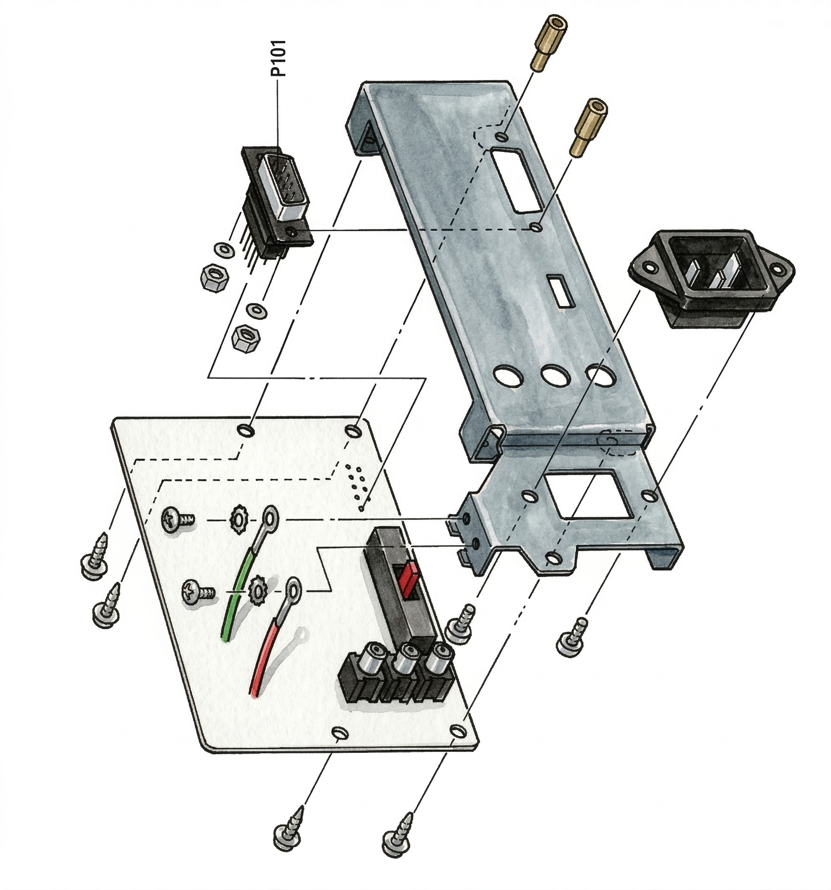

# How to Repair the Commodore Amiga 1080 Monitor: No Picture in RGB Mode

**Editor's Note:** The 1080 is famous for its crisp RGB output. If Composite works but RGB is dead, the fault is isolated to the RGB processing chain.

## 1. Technical Overview: RGB Signal Path

The RGB signals bypass the composite decoders and run through dedicated amplifiers and switching ICs (Q108, Q114, Q115, Q116) powered by a 5V line.

## 2. Symptoms: What does this look like?

* Composite video works perfectly.
* Switching to RGB yields a blank screen.

## 3. ⚠️ Critical Safety Warning

Ensure the video mode switches are de-energized and capacitors discharged if you are soldering near the RGB input terminals.

*Figure 1: Amiga 1080 Main Board (PW5252-3) - RGB processing circuitry location*

## 4. Required Tools for the Bench

* DMM

## 5. Step-by-Step Troubleshooting Flowchart

| Measurement Result | Likely Culprit | Action |
| :--- | :--- | :--- |
| DC voltage at 5V line is NG (No Good) | 5V Supply Components | Check/Replace D111, Q117. |
| Emitter of Q104, Q105, Q106 is NOT 4~6V | RGB Transistors | Check/Replace Q104, Q105, Q106. |
| Voltages at #8, #10, #12 of Q108 do not change when input changes from White to Black | Lead Wires / Q101 | Check/Replace Q101 and Lead Wire (M108, M109). |

*Figure 2: CRT Drive Board (PW5252-2) - RGB signal amplification stages*

## 6. Repair Conclusion & "Recap" Advice

RGB processing issues often stem from a dead 5V supply line (D111, Q117) or failure of the RGB switching transistors.

*Figure 3: AIN Board (PW5253) - Input switching and signal routing*

## 7. FAQ: Pro-Level Calibration

**Q: How do I adjust the white balance in RGB mode?**

A: First perform composite white balance. Then set switch S101 to Analog RGB, feed a white pattern, and adjust the GREEN and BLUE CUTOFF controls (R253, R251).

*Figure 4: Video Terminal Board - RGB input connectors and signal processing*

## More in:

For related issues, check out: [No Raster in RGB Mode](no-raster-rgb-mode.md) - Troubleshooting RGB mode raster generation problems.